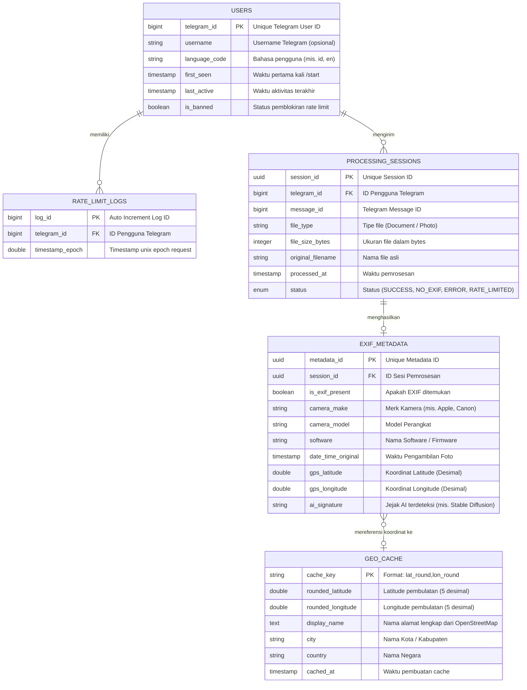

# Entity Relationship Diagram (ERD) - Telegram EXIF Bot 📊

Dokumen ini menjelaskan struktur entitas data dan skema relasi untuk **Telegram EXIF Cleaner & Inspector Bot**, baik untuk model *stateless in-memory* (MVP) maupun model persistensi data anonim (Fase 2 / Fase 3).

---

## 📈 Diagram ERD (Mermaid)

---

## 📑 Kamus Data (Data Dictionary)

### 1. `USERS` (Tabel Pengguna)
Menyimpan informasi anonim pengguna Telegram untuk pengelolaan sesi dan statistik.
| Nama Kolom | Tipe Data | Keterangan |
| :--- | :--- | :--- |
| `telegram_id` | `BIGINT (PK)` | Identifier unik pengguna dari Telegram API. |
| `username` | `VARCHAR(64)` | Username Telegram pengguna (jika ada). |
| `language_code` | `VARCHAR(10)` | Kode bahasa antarmuka pengguna. |
| `first_seen` | `TIMESTAMP` | Tanggal dan waktu pengguna pertama kali menjalankan `/start`. |
| `last_active` | `TIMESTAMP` | Tanggal dan waktu pengguna terakhir berinteraksi dengan bot. |
| `is_banned` | `BOOLEAN` | Flag penanda apakah pengguna diblokir akibat *abuse*. |

---

### 2. `PROCESSING_SESSIONS` (Sesi Pemrosesan Gambar)
Mencatat metadata transaksi pemrosesan gambar secara terpisah dari file biner.
| Nama Kolom | Tipe Data | Keterangan |
| :--- | :--- | :--- |
| `session_id` | `UUID (PK)` | Identifier unik sesi pemrosesan. |
| `telegram_id` | `BIGINT (FK)` | Relasi ke `USERS.telegram_id`. |
| `message_id` | `BIGINT` | ID Pesan Telegram tempat file dikirim. |
| `file_type` | `VARCHAR(20)` | `Document` atau `Photo`. |
| `file_size_bytes` | `INTEGER` | Ukuran file gambar dalam satuan Bytes. |
| `original_filename` | `VARCHAR(255)` | Nama file gambar yang dikirim pengguna. |
| `processed_at` | `TIMESTAMP` | Waktu pemrosesan dilakukan. |
| `status` | `ENUM` | `SUCCESS`, `NO_EXIF`, `ERROR`, `RATE_LIMITED`. |

---

### 3. `EXIF_METADATA` (Metadata Hasil Ekstraksi)
Menyimpan atribut hasil ekstraksi EXIF dari gambar.
| Nama Kolom | Tipe Data | Keterangan |
| :--- | :--- | :--- |
| `metadata_id` | `UUID (PK)` | Identifier unik record metadata. |
| `session_id` | `UUID (FK)` | Relasi ke `PROCESSING_SESSIONS.session_id`. |
| `is_exif_present` | `BOOLEAN` | `True` jika gambar mengandung tag EXIF. |
| `camera_make` | `VARCHAR(100)` | Produsen kamera/HP (e.g., Apple, Samsung). |
| `camera_model` | `VARCHAR(100)` | Seri/tipe kamera (e.g., iPhone 14 Pro). |
| `software` | `VARCHAR(150)` | Versi software atau firmware pengolah foto. |
| `date_time_original` | `TIMESTAMP` | Timestamp saat foto dipotret. |
| `gps_latitude` | `DOUBLE` | Latitude desimal (mis. `43.467448`). |
| `gps_longitude` | `DOUBLE` | Longitude desimal (mis. `11.885127`). |
| `ai_signature` | `VARCHAR(100)` | Deteksi generator AI (e.g., `Stable Diffusion`). |

---

### 4. `GEO_CACHE` (Cache Reverse Geocoding)
Menyimpan hasil *lookup* alamat dari OpenStreetMap/Nominatim API agar efisien dan hemat batas kuota.
| Nama Kolom | Tipe Data | Keterangan |
| :--- | :--- | :--- |
| `cache_key` | `VARCHAR(64) (PK)`| String unik pembulatan `lat_lon`. |
| `rounded_latitude` | `DOUBLE` | Latitude dibulatkan hingga 5 angka desimal. |
| `rounded_longitude`| `DOUBLE` | Longitude dibulatkan hingga 5 angka desimal. |
| `display_name` | `TEXT` | Nama alamat/lokasi lengkap hasil geocoding. |
| `city` | `VARCHAR(100)` | Nama Kota atau Kabupaten. |
| `country` | `VARCHAR(100)` | Nama Negara. |
| `cached_at` | `TIMESTAMP` | Tanggal & waktu pencatatan cache. |

---

### 5. `RATE_LIMIT_LOGS` (Tracking Pembatasan Laju)
Menyimpan histori timestamp request per pengguna untuk algoritma *sliding window rate limiter*.
| Nama Kolom | Tipe Data | Keterangan |
| :--- | :--- | :--- |
| `log_id` | `BIGINT (PK)` | Identifier log otomatis. |
| `telegram_id` | `BIGINT (FK)` | Relasi ke `USERS.telegram_id`. |
| `timestamp_epoch` | `DOUBLE` | Waktu Unix Epoch saat request terjadi. |
