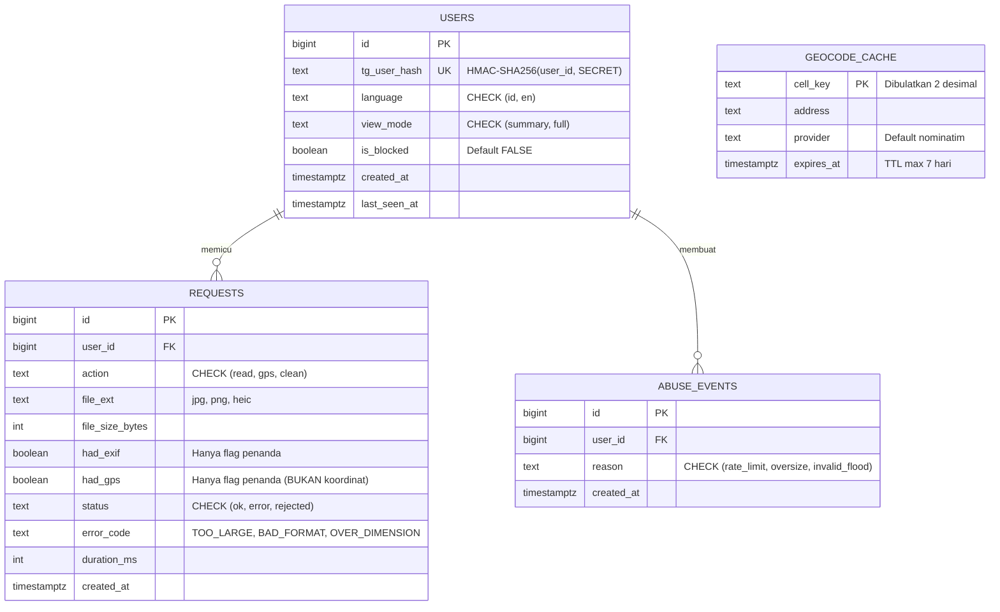

# EXIF Bot: PRD, ERD, Skema SQL, Desain, dan Aturan System (v0.1) 📋

Dokumen ini berisi spesifikasi lengkap untuk **Telegram EXIF Cleaner & Inspector Bot**, mencakup PRD, ERD, Skema SQL PostgreSQL/SQLite, State Machine, Callback Schema, serta Matriks Aturan Sistem (Validation, EXIF, Privacy, Rate Limit, Code & Ops).

---

## 📌 1. Principles & Privacy Guarantee
- **MVP Stateless**: Pemrosesan murni di RAM (`io.BytesIO`). Tidak ada database wajib di MVP.
- **Zero Privacy Footprint**: Isi foto, nilai EXIF mentah, dan koordinat GPS **tidak pernah disimpan ke disk atau database**.
- **HMAC Anonimisasi**: ID Telegram hanya disimpan dalam bentuk hash HMAC-SHA256 (`tg_user_hash`), bukan ID asli (Fase 2 opsional).

---

## 📊 2. Entity Relationship Diagram (ERD)



---

## 🗄️ 3. Skema SQL (PostgreSQL & SQLite)

### PostgreSQL Schema
```sql
CREATE TABLE users (
    id            BIGSERIAL PRIMARY KEY,
    tg_user_hash  TEXT        NOT NULL UNIQUE,
    language      TEXT        NOT NULL DEFAULT 'id' CHECK (language IN ('id','en')),
    view_mode     TEXT        NOT NULL DEFAULT 'summary' CHECK (view_mode IN ('summary','full')),
    is_blocked    BOOLEAN     NOT NULL DEFAULT FALSE,
    created_at    TIMESTAMPTZ NOT NULL DEFAULT now(),
    last_seen_at  TIMESTAMPTZ NOT NULL DEFAULT now()
);

CREATE TABLE requests (
    id              BIGSERIAL PRIMARY KEY,
    user_id         BIGINT      NOT NULL REFERENCES users(id) ON DELETE CASCADE,
    action          TEXT        NOT NULL CHECK (action IN ('read','gps','clean')),
    file_ext        TEXT,
    file_size_bytes INT         CHECK (file_size_bytes >= 0),
    had_exif        BOOLEAN,
    had_gps         BOOLEAN,
    status          TEXT        NOT NULL CHECK (status IN ('ok','error','rejected')),
    error_code      TEXT,
    duration_ms     INT,
    created_at      TIMESTAMPTZ NOT NULL DEFAULT now()
);
CREATE INDEX idx_requests_user_time ON requests (user_id, created_at DESC);
CREATE INDEX idx_requests_created   ON requests (created_at);

CREATE TABLE abuse_events (
    id         BIGSERIAL PRIMARY KEY,
    user_id    BIGINT      NOT NULL REFERENCES users(id) ON DELETE CASCADE,
    reason     TEXT        NOT NULL CHECK (reason IN ('rate_limit','oversize','invalid_flood')),
    created_at TIMESTAMPTZ NOT NULL DEFAULT now()
);
CREATE INDEX idx_abuse_user_time ON abuse_events (user_id, created_at DESC);

CREATE TABLE geocode_cache (
    cell_key   TEXT PRIMARY KEY,
    address    TEXT        NOT NULL,
    provider   TEXT        NOT NULL DEFAULT 'nominatim',
    expires_at TIMESTAMPTZ NOT NULL
);
```

---

## 🔄 4. State Machine & Callbacks

### Callback Schema
| Tombol | `callback_data` | Kondisi Kemunculan |
| :--- | :--- | :--- |
| 📍 Lokasi GPS | `act:gps` | Koordinat valid (-90..90, -180..180) ditemukan |
| 🧹 Hapus EXIF | `act:clean` | Metadata EXIF terdeteksi pada gambar |
| 📄 Semua Tag | `act:full` | Mode tampilan `summary` aktif |
| 📋 Ringkasan | `act:summary` | Mode tampilan `full` aktif |

---

## 📜 5. Matriks Aturan System (System Rules)

### 5.1 Validasi Input (V-1 s/d V-5)
- **V-1**: Hanya menerima document ber-MIME `image/*` atau `photo`.
- **V-2**: Maksimal ukuran 20 MB (ditolak sebelum diunduh berdasarkan `file_size`).
- **V-3**: Format yang didukung: JPG, PNG, TIFF, WebP; HEIC jika `pillow-heif` terinstall.
- **V-4**: Dimensi maksimal **12.000 px** per sisi untuk mencegah *memory exhaustion bomb*.
- **V-5**: File yang gagal dibuka Pillow dianggap `BAD_FORMAT`.

### 5.2 Pemrosesan EXIF (E-1 s/d E-5)
- **E-1**: Kegagalan parsing satu tag (mis. nilai rusak atau penyebut nol) tidak menghentikan proses; tag tersebut dilewati.
- **E-2**: Validasi koordinat GPS: Lintang di `-90..90` dan Bujur di `-180..180`.
- **E-3**: Nilai `bytes` di atas 40 byte dilewati dalam tampilan teks (seperti MakerNote).
- **E-4**: Hapus EXIF dilakukan tanpa parameter `exif=`, mempertahankan orientasi piksel (`exif_transpose`).
- **E-5**: Foto terkompresi tanpa EXIF selalu disertai saran untuk mengirim ulang sebagai **File/Dokumen**.

### 5.3 Aturan Privasi (P-1 s/d P-6)
- **P-1**: Pemrosesan murni di memori RAM. Berkas sementara wajib dihapus di blok `finally`.
- **P-2**: Dilarang menyimpan/mencatat nilai EXIF, alamat, atau koordinat GPS.
- **P-3**: Telegram User ID hanya disimpan dalam bentuk HMAC-SHA256 hash (`tg_user_hash`).
- **P-4**: Log hanya berisi aksi, status, error_code, dan durasi.
- **P-5**: Cache geocoding default nonaktif; TTL maksimal 7 hari jika diaktifkan.
- **P-6**: Perintah `/hapus_data` menghapus seluruh data baris user terkait secara permanen.

### 5.4 Rate Limit & Abuse (R-1 s/d R-5)
- **R-1**: Maksimal 10 request/menit, 100 request/hari per pengguna.
- **R-2**: Maksimal 2 pemrosesan bersamaan (*concurrent*) per pengguna.
- **R-3**: 3 kali pelanggaran rate limit dalam 10 menit menyebabkan *temporary hold* 15 menit.
- **R-4**: User dengan `is_blocked = TRUE` diabaikan tanpa balasan.
- **R-5**: Request Nominatim maksimal 1 req/detik dengan `User-Agent` yang jelas.

### 5.5 Kode & Operasional (K-1 s/d K-5)
- **K-1**: Token & Secret diset hanya melalui Environment Variable (`.env` di-ignore).
- **K-2**: Layanan (`exif_service`, `geo_service`) *decoupled* dari objek Telegram.
- **K-3**: Timeout operasi jaringan diset **10 detik**.
- **K-4**: Pesan error ramah pengguna tanpa *stack trace* teknis di antarmuka chat.
- **K-5**: Unit test mencakup: tanpa EXIF, EXIF rusak, GPS valid, GPS di luar rentang, file oversize, & batas dimensi.
